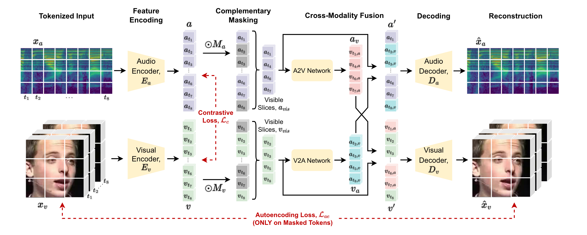

# Open-AVFF
This is an unofficial pytorch implementation of the closed-source newly published work [AVFF: Audio-Visual Feature Fusion for Video Deepfake Detection](https://arxiv.org/abs/2406.02951). It's also submission for our kaggle competition: [Inclusion・The Global Multimedia Deepfake Detection](https://www.kaggle.com/competitions/multi-ffdv). We'll turn our attention to strictly follow the steps shown in the original AVFF pape, and try to reproduce its main experiments result after the end of the competition. Please follow us for any further progress.



## To-Do List
- [x] Release code and model for the Inclusion:DDFV kaggle challenge
- [ ] Follow AVFF and add adversarial losses to the final loss weights in representation learning stage.
- [ ] Follow AVFF and adopt pretraining weight of MARLIN.
- [ ] Try to reproduce AVFF's result on the FakeAVCeleb Dataset

## Contents
- [Intsall](#install)
- [Open-AVFF Weights](#open-avff-weights)
- [Evaluation](#evaluation)
- [Demo](#demo)
- [Train](#train)

## Install
First create a conda virtual environment:
```
conda create -n AVFF python=3.8 -y
conda activate AVFF
```
then run the `pip install -r requirements.txt` script, which will install the following modules for you:
```
torch==2.3.1
torchaudio==2.3.1
torchvision==0.18.1
decord
einops
jupyter
matplotlib
opencv-python
pillow
timm==0.4.5
tqdm
scipy
scikit-learn
```

## Open-AVFF Weights
We partition our training to three stages: (i) Self-supervised training on the large-scale Kinetics400 dataset; (ii) Self-supervised training on the large-scale Kinetics400 dataset; (iii) Finetune on the final deepfake classification task. You can download the our provided weights of each stage or follow the steps in [Train](#train) to set up your own training schedule.
- [Stage1 Weights](https://drive.google.com/file/d/1OUpwO3X45BDR81OLf9Q_WTzGxFTu_ynN/view?usp=sharing) 
- [Stage2 Weights](https://drive.google.com/file/d/1Yvh4tS8gYGrBOTjz1EM_BIKIsO1F9lCx/view?usp=sharing) 
- [Stage3 Weights](https://drive.google.com/drive/folders/1QrtQWf5_fcybBifAMpkBZpWpW0VUpVlQ?usp=sharing) 

## Evaluation
Download our pre-trained stage-3 weights and place it under `path/to/stage-3.pth`. Replace the `path/to` prefix in the csv file to your own root dir of the video set. Then run the following script which will creat a csv file containing all prediction scores under your work dir.
```
python eval.py --checkpoint path/to/stage-3.pth --csv_file data/testset.csv
```

## Demo
Please refer to our [reconstruction demo](/reconstruction_demo.ipynb) to see the effectiviness of our pretraining stage mask autoencoding reconstruction.

## Train
- Stage 1: Self-Supervised Pretraining on Kinetics400 \
    You'll firstly need to create two csv files contains all videos in the kinetics 400 train/val set, and replace the `tr_data/te_data` with path to your own csv train/val files. Please refer to our csv file examples under `data` folder to create your own csv file. Then run the following script:
    ```
    cd ./egs
    bash stage-1.sh
    ```
    It will take around 20 hours for the training to complete. Notice that we perform this stage of training on 8*A100(80GB) gpus. For training on RTX4090/3090, please change batch_size from 128 to 48.
- Stage 2: Self-Supervised Pretraining on Real-face Videos \
    We mainly follow the setups in stage 1, but change the batch size to 48 for easy reproduction. Replace the `pretrain_path` with your own path to the stage 1 pretraining weight, then run the following script:
    ```
    cd ./egs
    bash stage-2.sh
    ```
- Stage 3: Finetuning on the Deepfake Classification Task \
    Since we made a few changes to our network when progress from stage1/2 to stage3 (replace the decoder part with mlp head for classification), you need to run the scripts provided in the [adapt_pretraining_weights.ipynb](./adapt_pretraining_weights.ipynb) to obtain initial weight for stage 3. Then run:
    ```
    cd ./egs
    bash stage-3.sh
    ```